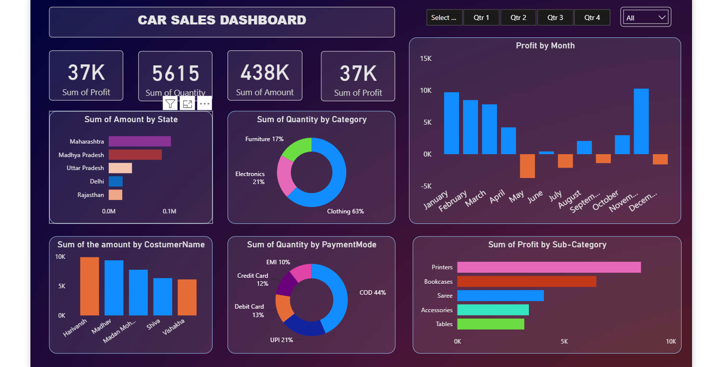

# 🚗 Car Sales Analytics Dashboard (Power BI)

An interactive Power BI solution designed to analyze sales performance, profitability, customer behavior, and product trends across multiple regions. The dashboard transforms raw sales data into actionable business insights through dynamic visualizations and KPI tracking.

> 📊 Interactive Dashboard  |  📈 Business Intelligence  |  ⚡ DAX-Powered Analytics  |  🎯 Data-Driven Decision Making

---

## ✨ Features

### 📊 Executive KPI Dashboard

* Total Sales Tracking
* Total Profit Analysis
* Quantity Sold Monitoring
* Average Order Value Insights
* Dynamic filtering by Quarter and State

### 📈 Sales Performance Analysis

* State-wise revenue comparison
* Monthly profit trend visualization
* Quarter-over-quarter sales analysis
* Identification of top-performing regions

### 👥 Customer Insights

* Customer-wise sales contribution
* High-value customer identification
* Revenue distribution across customer segments

### 🛍️ Product & Category Analysis

* Category-wise quantity sold
* Sub-category profitability analysis
* Product performance tracking
* Best-selling product identification

### 💳 Payment Mode Analysis

* COD vs Online Payment comparison
* Payment preference trends
* Revenue contribution by payment method

### 🎨 Interactive Visualizations

* Dynamic slicers and filters
* Drill-down capabilities
* Responsive dashboard design
* Real-time business insights

---

## 🗂️ Dashboard Components

| Component             | Purpose                                 |
| --------------------- | --------------------------------------- |
| KPI Cards             | Track Sales, Profit, Quantity, and AOV  |
| State Analysis        | Compare sales across states             |
| Monthly Trend         | Analyze profit trends over time         |
| Customer Analysis     | Identify top customers                  |
| Category Analysis     | Evaluate category performance           |
| Payment Mode Analysis | Understand customer payment preferences |
| Slicers               | Filter data by Quarter and State        |

---

## 🧠 Business Questions Answered

* Which state generates the highest revenue?
* Which product categories drive the most sales?
* Who are the top customers?
* What payment method is most preferred?
* How does profit vary month by month?
* Which sub-categories are the most profitable?

---

## ⚙️ Tools & Technologies Used

| Tool          | Purpose                  |
| ------------- | ------------------------ |
| Power BI      | Dashboard Development    |
| Excel         | Data Source & Cleaning   |
| Power Query   | Data Transformation      |
| DAX           | KPI and Measure Creation |
| Data Modeling | Relationship Building    |

---

## 📊 Key Metrics Tracked

* Total Sales
* Total Profit
* Quantity Sold
* Average Order Value
* Monthly Profit Trend
* State-wise Revenue
* Customer Performance
* Payment Mode Distribution

---

## 📷 Dashboard Preview

---

## 🎯 Skills Demonstrated

* Data Cleaning
* Data Transformation
* Data Modeling
* DAX Calculations
* Business Intelligence
* Dashboard Development
* Data Visualization
* Analytical Thinking
* KPI Design

---

## 🚀 Getting Started

### Requirements

* Power BI Desktop
* Dataset (.xlsx / .csv)

### Steps

1. Download the repository
2. Open the `.pbix` file in Power BI Desktop
3. Refresh the dataset if required
4. Explore dashboard filters and visualizations

---

## 💼 Business Impact

This dashboard enables decision-makers to:

* Monitor sales performance efficiently
* Identify profitable products and regions
* Understand customer purchasing behavior
* Improve strategic planning through data-driven insights

---

## 🔮 Future Improvements

* Forecasting using Time Series Analysis
* Customer Segmentation Dashboard
* Sales Prediction Models
* Power BI Service Deployment
* Automated Data Refresh
* Mobile Dashboard Optimization

---

## ⭐ Project Highlights

* End-to-End BI Project
* Interactive Dashboard Design
* Real Business KPIs
* Advanced DAX Measures
* Professional Reporting Solution
